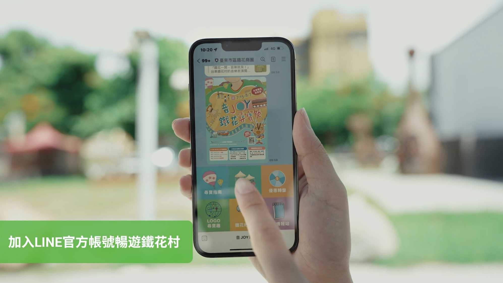
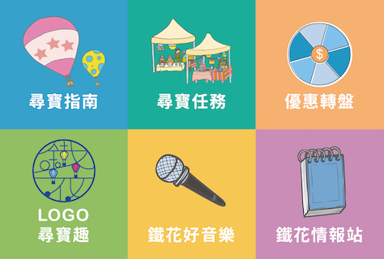
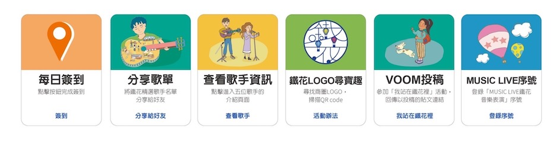
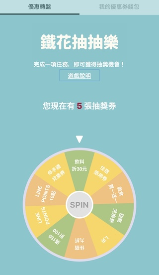
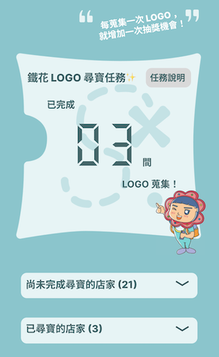
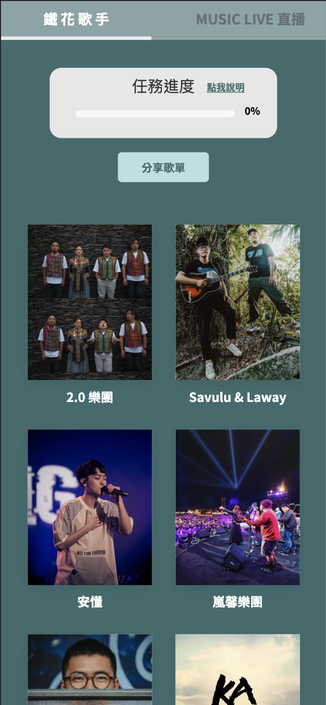
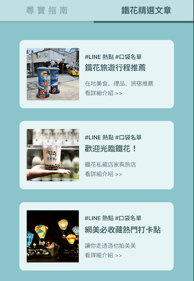
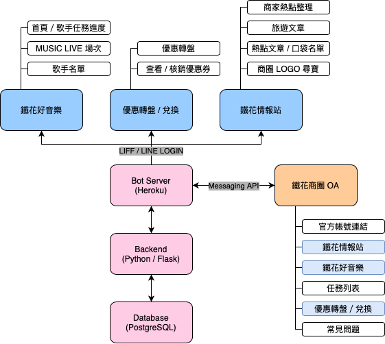

# LINEFRESH_in_Tiehua 音JOY鐵花尋寶祭

此為 LINE FRESH 2021 校園競賽冠軍隊伍「雙管齊下」為台東鐵花商圈所打造的在地數位創生活動「音JOY 鐵花尋寶祭」之 LINE 官方帳號。  
我們以台東鐵花商圈濃厚音樂藝文氣息為亮點，串聯了鐵花商圈商家、鐵花音樂聚落並整合 LINE 多項數位服務，包括 LINE 旅遊、LINE 熱點、LINE MUSIC Live、LINE Beacon、LINE Pay 等，共同攜手打造「音 JOY 鐵花尋寶祭」期間限定活動，將當地獨特音樂元素帶入年輕世代，邀請旅客齊聚台東鐵花商圈，開啟夏日尋寶旅程，更藉由 LINE 深入體驗當地飲食、旅遊及音樂等各種文化面向。  

  

## 官方帳號功能介紹
在音 JOY 鐵花尋寶祭 OA 中，我們設計了「尋寶任務」、「優惠轉盤」、「LOGO 尋寶趣」、「鐵花好音樂」、「尋寶指南」、以及「鐵花情報站」等六項功能，以線上及線下任務遊戲為主軸，帶領遊客們成為探險家，探索鐵花的音樂世界。
  
  
* 尋寶任務  
  
以 flex message 方式呈現，羅列出探險家們所有可進行的任務。  
  
* 優惠轉盤  
  
包含轉盤遊戲以及優惠券錢包 LIFF 頁面，
當探險家完成一次任務後，即可獲得一次轉盤機會。  
並會將得到所有優惠呈現在錢包頁面中，可逕行至該商家兌換。  
  
* LOGO 尋寶趣  
  
活動任務主軸，在鐵花商圈中找尋「台東市區鐵花商圈」LOGO，並掃描所屬之 QR code，即完成一次任務。  
該 LIFF 頁面會統計並呈現探險家已蒐集及未搜集的店家 LOGO。  
  
* 鐵花好音樂  
  
任務之一，以線上展覽方式在 LIFF 中介紹鐵花在地歌手，包含文字介紹及相關歌曲連結。  
每瀏覽兩位歌手介紹即完成一次任務。  
  
* 尋寶指南  
  
記載音 JOY 鐵花尋寶祭所有相關規則及 LINE Spot、LINE Travel 上相關文章。  
  
* 鐵花情報站  
連結 LINE Spot 活動主頁面。

## 技術架構
  
  
## 相關報導
* [Youtube 紀錄影片](https://youtu.be/XSDIq7LQvbw)
* [LINE BLOG](https://linecorp.com/zh-hant/pr/news/zh-hant/2022/4300)  
* [數位時代](https://www.bnext.com.tw/article/71793/line-fresh-2022-joy)  
* [聯合新聞網](https://udn.com/news/story/7266/6469491)
* [中央通訊社](https://www.cna.com.tw/news/afe/202207150234.aspx)

